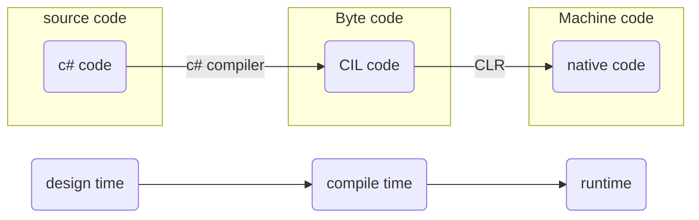

---
aliases:
  - C#
---
## `C#`
compiles source code to [[Common intermediate Language|CIL]] during **compile time**
the C Sharp Compiler `csc.exe`lives in the [[dot NET|.NET]] Framework install folder.
CIL can be found in the .exe and .dll binaries. [[assembly]]
each machine gets the same assembly (.exe file).
but machines and CPUs are different, so on execution the [[Common Language Runtime|CLR]] translates the CIL to instructions for the machine it runs on. This execution is called **runtime**.

#### terms
source code
byte code 
c# code
c# compiler 
CIL code
compile time
CLR
machine code
native code 
runtime

[[programming language]]
