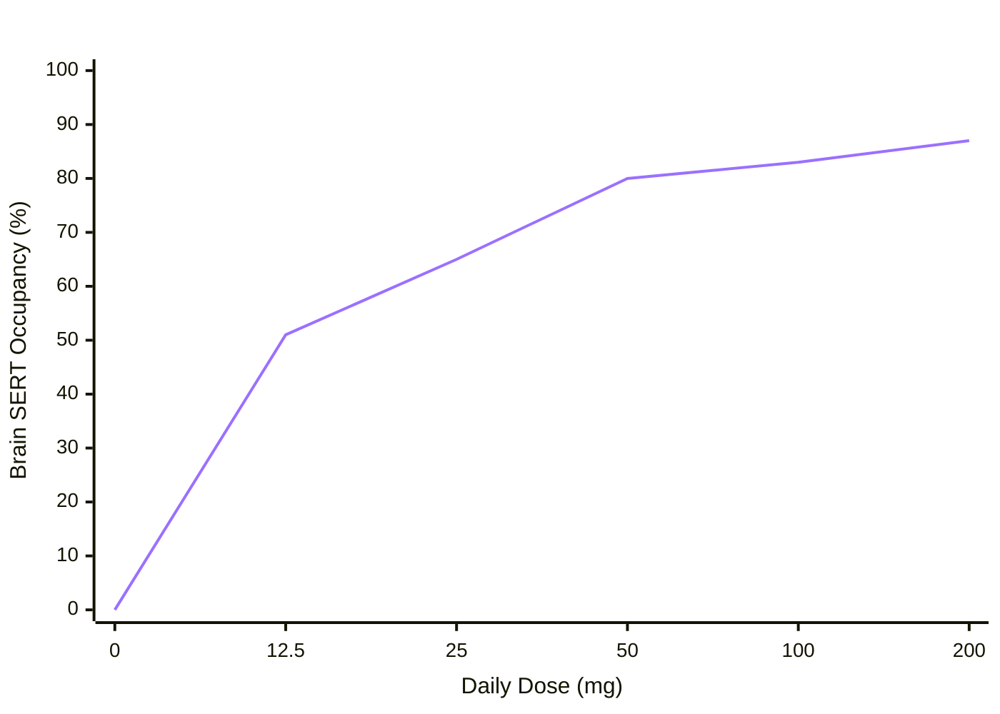

---
sentiment:
  - 5
sentiment-hash: 1f251cae
sentiment-label:
  - factual
tags:
  - ai-generated
  - technical
  - solved
origin-sha: 4e01ac96c
created: 2025-05-29
---

# Fixing Mermaid XY Chart Rendering in Obsidian

When using Mermaid's `xychart-beta` diagram type in [[Obsidian]], line elements or bars can sometimes render as invisible or extremely dark containers (especially in Dark Mode).

## Root Cause

1. **Hidden Stroke / Zero Line Width**: In some versions of Obsidian's built-in Mermaid engine, SVG `<path>` elements generated by `xychart-beta` line charts default to `stroke-width: 0` or take on background color properties.
2. **Dark Mode Contrast**: Default plot palettes for `xychart-beta` can map to low-contrast dark blue/black colors that blend into dark themes.

## Solution Implemented

### 1. Embedded Mermaid Theme Config
Inside the markdown note, prepend an `init` directive directly to the `mermaid` block to set explicit, high-contrast theme variables:

```markdown

```

### 2. Custom CSS Snippet Override
Create a custom snippet in `.obsidian/snippets/mermaid-xychart-fix.css`:

```css
/* Fix Obsidian Mermaid XY Chart line & marker visibility in Dark Mode */
.mermaid svg[aria-roledescription="xychart"] path.line,
.mermaid svg[aria-roledescription="xychart"] g > g > path,
.mermaid svg path {
    stroke-width: 3px !important;
    stroke: #9b70ff !important;
    opacity: 1 !important;
    visibility: visible !important;
}

/* Data point markers */
.mermaid svg[aria-roledescription="xychart"] circle,
.mermaid svg circle {
    fill: #bca0ff !important;
    stroke: #ffffff !important;
    stroke-width: 1.5px !important;
    r: 4px !important;
}

/* Axis & text visibility */
.mermaid svg[aria-roledescription="xychart"] text,
.mermaid svg text {
    fill: #e0e0e0 !important;
    font-weight: 500 !important;
}
```

### 3. Enabling in Obsidian
Add `"mermaid-xychart-fix"` to the `enabledCssSnippets` array in `.obsidian/appearance.json`:

```json
{
  "enabledCssSnippets": [
    "mermaid-xychart-fix"
  ]
}
```

See also: [[Obsidian review for personal documents]], [[serotonin]]
