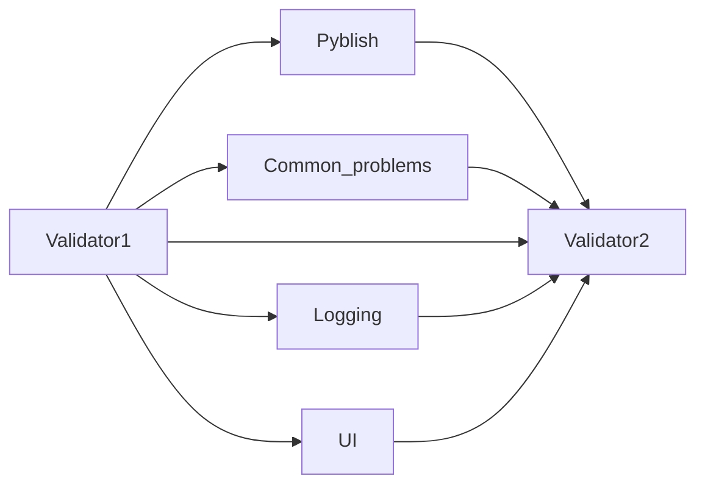
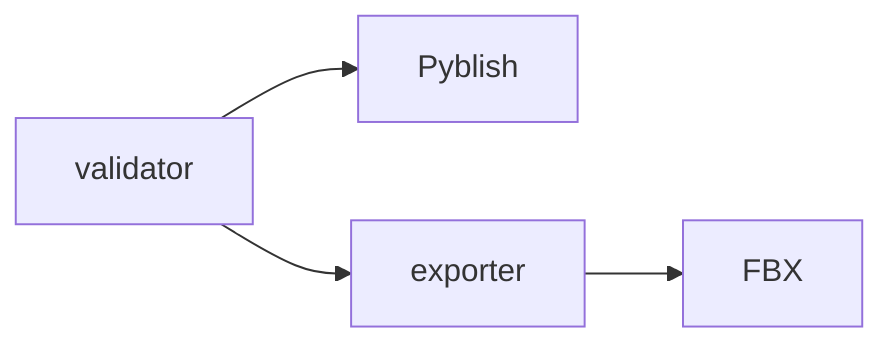

some links are loose, others are close.

## close relation
2 `validator` tools, from different projects, might share concepts & libraries, so are closely related. Reading about one likely will help with developing the other.

## Loose relation
The `validator` & `exporter` are used together in the same workflow, but share no underlying tech, so their relationship is looser. Reading about one tool, might offer range leading to insight, but it won't contain previously solved problems that are related.

## learning
Close links can offer a lot of value, since they might contain solutions to problems solved in the past. 
Review your previously solved problems at previous jobs, and you might notice the answer to a current problem is something you already solved once.

## Obsidian
How can we discover strong links? The graph view pulls nodes closer to each other if they have multiple links.

[[link]]
