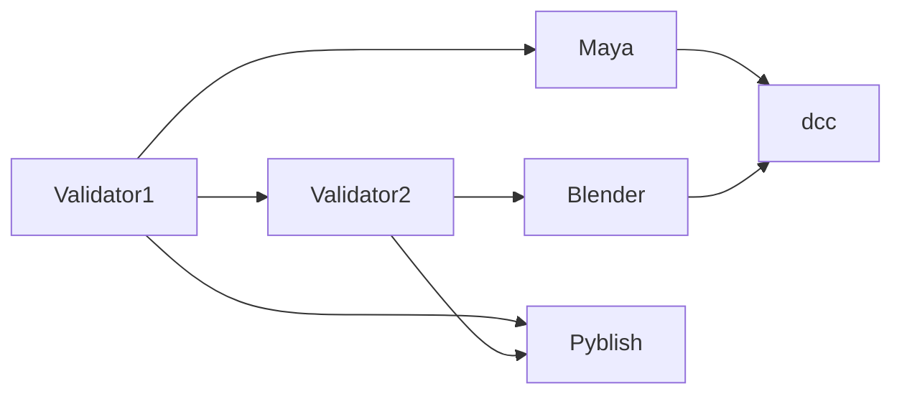

some links are loose, others are close.

e.g. 2 tools, sharing various concepts and libraries are closely related.
2 tools, that are used together in a workflow but share no underlying tech are less related

#link