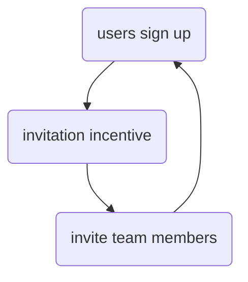

Airtable is extremely successful, thanks to their simple [[onboarding]].
[source](https://www.linkedin.com/posts/maximpoulsen_5-onboarding-lessons-from-an-11b-company-ugcPost-7148296667191013376-ZD2i/?utm_source=tldrmarketing)

1. First ask user, *"what team are you in?"* buttons with teams.
   to show right template after
   different users have different cases
   
2. reward sharing
  get more done with your team. add emails / invite link
  earn credit for each invite
  more collab = more stickiness
  (also part of their value prop)

3. make it theirs. customize.
   move your data to Airtable. import google sheet, excel, [[csv]], ...
   
4. tutorial on how to use, pop ups walking you through the controls
  lots of docs online
  
5. (premade) templates to quickly get up and running
   templates are created based on onboarding data
   each template has a tutorial and video
   
6. reverse trail
   free users can try pro for 14 days
   revert to free at end. not cut off
   remind users what features are in pro
   build complex workflow for free, users don't want to loose it so they upgrade [[sunk cost]] 