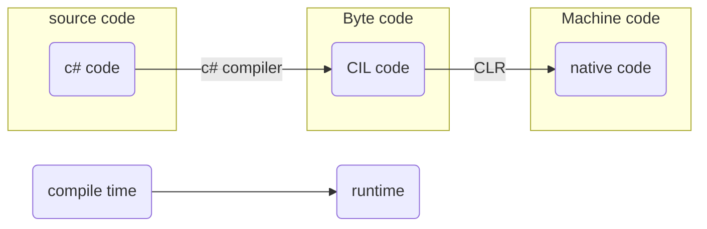

---
aliases:
  - .NET
---

3 flavors:
- .NET Framework
- .NET Core
- Xamarin (Mono.Net) 

### .NET Framework
The original framework.
- distributed default with Windows.
Mainly to develop Windows apps  of standard ASP.NET 4.x webapps for IIS, the webserver for Windows systems.

apps build require .NET Framework to be preinstalled.
### .NET Core
- cross platform Windows, Linux, Mac, Docker.
- open source
- GUI can only be used on Windows.
  WPF-applicaties (Windows Presentation Forms).
- distributed with app

### Xamarin (Mono.Net)
- cross platform iOS, OS X, Android
- open source
- Mono-based runtime (Mono.NET)
- distributed with app

## `c#`
compiles source code to [[Common intermediate Language|CIL]] during **compile time**
CIL can be found in the .exe and .dll binaries.
each machine gets the same assembly (.exe file).
but machines and CPUs are different, so on execution the [[Common Language Runtime|CLR]] translates the CIL to instructions for the machine it runs on. This execution is called **runtime**.

#### terms
source code
byte code 
c# code
c# compiler 
CIL code
compile time
CLR
machine code
native code 
runtime

