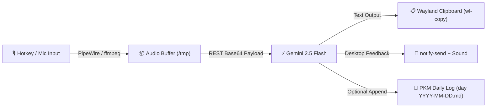

> [!summary] eli5
> press a hotkey on the ThinkPad, speak a thought or prompt, and press again: Gemini Flash transcribes or answers in ~1 second, copies the text to the clipboard, and appends it to today's daily log.

> [!todo] next
> **next:** map `python3 scripts/voice_gemini.py --toggle` to a GNOME custom keyboard shortcut (e.g. `F12` or `Super+Alt+V`).
> **blocked:** nothing.

## what it is

a lightweight voice capture and processing pipeline running locally on Fedora GNOME (Wayland) on the ThinkPad.

audio records directly from PipeWire using `ffmpeg` into 16kHz mono Opus, then posts to the Gemini REST API via standard library Python (`urllib.request`), requiring zero extra pip packages.

## what works

`scripts/voice_gemini.py` implements the complete standalone pipeline:

- **Hotkey toggle:** running with `--toggle` starts recording on first press (saves PID, plays chime, pops recording notification). Second press stops ffmpeg cleanly, submits audio, and plays completion chime.
- **Direct REST API:** talks directly to `gemini-2.5-flash` with fallback across `gemini-2.0-flash`, `gemini-flash-latest`, and `gemini-1.5-flash`.
- **Operating modes:**
  - `auto`: answers questions or formats thoughts into notes.
  - `dictate`: pure speech-to-text with punctuation cleanup.
  - `pkm`: markdown thoughts with wikilinks.
  - `assistant`: direct answers to voice questions.
- **Desktop delivery:** automatically copies response into clipboard via `wl-copy` and triggers `notify-send`.
- **Vault sync:** `--pkm` flag appends formatted voice memos directly to today's daily note under a timestamped bullet.

## what is open

- **GNOME shortcut mapping:** bind the toggle command to a dedicated hotkey (e.g. `F12`, `Super+Alt+V`, or ThinkPad mic mute button).
- **Voice activity detection (VAD):** auto-stop recording after 1.5s of silence so manual stop press is optional.
- **Offline local fallback:** integrate `faster-whisper` and Piper TTS for offline dictation and voice replies when internet is disconnected.
- **Conversational voice loop:** add text-to-speech playback (`pw-play`) for hands-free Q&A.

related: [[speech to text - Python]], [[hardware]]
