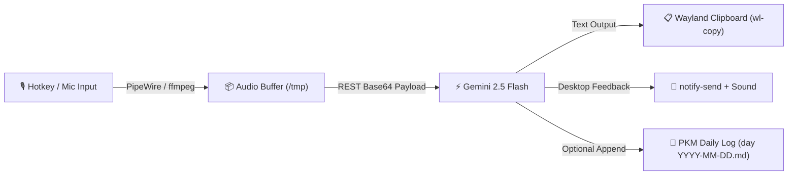

> [!summary] eli5
> press a hotkey on the ThinkPad, speak a thought or prompt, and press again: Gemini Flash transcribes or answers in ~1 second, copies the text to the clipboard, and appends it to today's daily log.

> [!todo] next
> **next:** map `python3 scripts/voice_gemini.py --toggle` to a GNOME custom keyboard shortcut (e.g. `F12` or `Super+Alt+V`).
> **blocked:** nothing.

## what it is

a lightweight voice capture and processing pipeline running locally on Fedora GNOME (Wayland) on the ThinkPad.

audio records directly from PipeWire using `ffmpeg` into 16kHz mono Opus, then posts to the Gemini REST API via standard library Python (`urllib.request`), requiring zero extra pip packages.

## plan & phases

### Phase 1: Core Ephemeral Push-to-Talk Pipeline (Done)
- `scripts/voice_gemini.py` standalone CLI with toggle recording, PipeWire audio capture, and direct REST connection to `gemini-2.5-flash`.
- Automatic model fallback chain (`gemini-2.5-flash` -> `gemini-2.0-flash` -> `gemini-flash-latest` -> `gemini-1.5-flash`).
- 100% ephemeral audio buffering in `/tmp/` (deleted immediately after processing).
- Domain glossary prompt injection to disambiguate technical terms (`LODs`, `UVs`, `DCC`, `shaders`, `DAG`, `FTS5`).
- Wayland clipboard (`wl-copy`), notifications (`notify-send`), and daily note append (`--pkm`).

### Phase 2: Desktop Integration & Hotkey Ergonomics (Active)
- Bind toggle trigger to GNOME custom keyboard shortcut (`Super+Alt+V`, `F12`, or ThinkPad mic mute button).
- Support optional multi-provider backend switching (Groq Whisper for ~250ms raw transcription + Cerebras/Gemini for reasoning).
- Provide visual recording indicator in GNOME status bar or notification banner.

### Phase 3: Vault Retrieval & Agent Action Bridge (Planned)
- Route spoken questions ("what did I write about X yesterday?") through [[progress - local-first search daemon and indexer|pkm-search]] on `127.0.0.1:44771`.
- Enable agent command execution for automated note creation, task logging, and file searching without typing.

### Phase 4: Hands-free VAD & Local Offline Fallback (Planned)
- Voice Activity Detection (VAD) to auto-stop recording on 1.5s of silence.
- Local offline STT via `faster-whisper` and local TTS playback via Piper / Kokoro for hands-free audio talkback.

## what works

`scripts/voice_gemini.py` implements the complete standalone pipeline:

- **Hotkey toggle:** running with `--toggle` starts recording on first press (saves PID, plays chime, pops recording notification). Second press stops ffmpeg cleanly, submits audio, and plays completion chime.
- **Direct REST API:** talks directly to `gemini-2.5-flash` with zero third-party Python dependencies.
- **Operating modes:**
  - `auto`: answers questions or formats thoughts into notes.
  - `dictate`: pure speech-to-text with punctuation cleanup.
  - `pkm`: markdown thoughts with wikilinks.
  - `assistant`: direct answers to voice questions.
- **100% ephemeral audio:** audio files are buffered in `/tmp` during recording and unlinked immediately after ingestion, keeping the vault 100% text-only with zero Git binary bloat.
- **Domain vocabulary disambiguation:** Gemini system prompts include a technical art, gamedev, and PKM glossary (LODs, DCC, Maya, Blender, shaders, drawcalls, DAG, FTS5, ONNX), allowing the LLM's attention mechanism to accurately disambiguate homophones (e.g. `LODs` vs `lots`, `UVs` vs `you've`) from surrounding context.
- **Desktop delivery:** automatically copies response into clipboard via `wl-copy` and triggers `notify-send`.
- **Vault sync:** `--pkm` flag appends formatted voice memos directly to today's daily note under a timestamped bullet.

## architectural decisions & trade-offs

- **Ephemeral vs Archiving:** raw audio is discarded post-processing. Binary audio files in Git bloat `.git` history permanently and are rarely replayed; text-only keeps the vault fast, portable, and indexable.
- **Direct API vs AGY Session Quota:** voice capture calls the Google AI Studio REST API directly (1,500 free requests/day on Flash). This delivers sub-1.5s latency and consumes 0 AGY agent credits, reserving agent sessions for deep repository refactoring.
- **Prompted Homophone Disambiguation:** rather than fine-tuning acoustic speech models, injecting a concise domain vocabulary in the multimodal system prompt leverages Gemini's language attention to distinguish jargon from acoustic homophones.

## what is open

- **GNOME shortcut mapping:** bind the toggle command to a dedicated hotkey (e.g. `F12`, `Super+Alt+V`, or ThinkPad mic mute button).
- **Voice activity detection (VAD):** auto-stop recording after 1.5s of silence so manual stop press is optional.
- **Offline local fallback:** integrate `faster-whisper` and Piper TTS for offline dictation and voice replies when internet is disconnected.
- **Conversational voice loop:** add text-to-speech playback (`pw-play`) for hands-free Q&A.

related: [[speech to text - Python]], [[hardware]], [[progress - local-first search daemon and indexer]], [[profile]]
