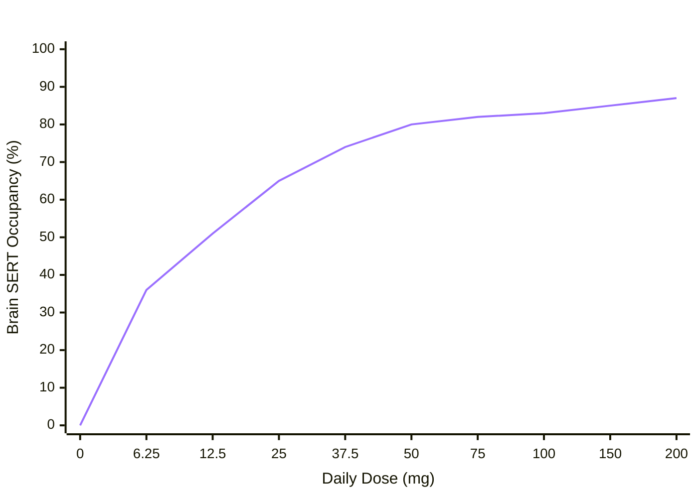

---
sentiment:
- 5
sentiment-hash: f1d5dca4
sentiment-label:
- factual
tags:
- medical
- health
---

An overview of sertraline (Zoloft) dosing efficiency, receptor occupancy, and clinical application across different psychiatric conditions—formatted cleanly for local Obsidian markdown notes.

# Sertraline (Zoloft) Dosing Efficiency & Mechanism Overview

## Executive Summary

Sertraline follows a **hyperbolic (non-linear) dose-response curve** (just like [[atorvastatin]]) governed primary by central **Serotonin Transporter ([[SERT occupancy|SERT]])** occupancy in the brain.

- **The ~80% Threshold:** Brain PET imaging demonstrates that optimal antidepressant response requires **~80% [[SERT occupancy]]**, which is achieved at **50 mg/day**.
- **Diminishing Returns:** Moving from 12.5 mg to 50 mg produces a steep, high-efficiency gain in receptor blockade. Beyond 50 mg, the curve plateaus significantly due to receptor saturation. Increasing doses to 100–200 mg yields minor incremental receptor occupancy while side-effect burden rises linearly.
- **Condition-Specific Variations:** While Major Depressive Disorder (MDD) and Generalized Anxiety Disorder (GAD) peak in efficacy around 50 mg, condition-specific neurobiology (such as [[Obsessive-Compulsive Disorder]]) often requires maximal dosing (150–200+ mg) to drive deeper downstream neuroplasticity.

## Dose-Response & Receptor Occupancy Matrix

| **Daily Dose** | **Brain [[SERT occupancy|SERT Occupancy]]** | **Efficacy Gain**     | **Clinical Role & Primary Usage**                                                                                 | **Side Effect Profile** |
| -------------- | ------------------------ | --------------------- | ----------------------------------------------------------------------------------------------------------------- | ----------------------- |
| **0 mg**       | 0%                         | Baseline              | No medication. Natural serotonin transporter activity; baseline for comparison.                                   | None                              |                         |
| **12.5 mg**    | ~50–52%                    | Low / Initial         | Starting titration for micro-sensitive, elderly, or pediatric patients to prevent early arousal.                  | Minimal                           |                         |
| **25 mg**      | ~65–66%                    | Sub-therapeutic       | Typical starting dose for [[Panic Disorder]], PTSD, and Social Anxiety to build early tolerance.                  | Mild                              |                         |
| **50 mg**      | **~76–80%**                | **Optimal Threshold** | **Standard therapeutic baseline for Major Depressive Disorder (MDD).** Reaches target target biological response. | Moderate                          |                         |
| **100 mg**     | ~82–83%                    | Diminishing           | Dose escalation for partial responders to 50 mg in depression or GAD.                                             | Moderate–High                     |                         |
| **150–200 mg** | ~85–87%                    | Plateaued             | Target dose range for [[Obsessive-Compulsive Disorder]] (OCD) and severe treatment-resistant cases.               | Highest                           |                         |




> [!NOTE]- Dose-Efficacy & Indication Flowchart
> 
> ```mermaid
> graph TD
>     %% Base Titration
>     Start[Sertraline Initiation] --> D12["12.5 mg / day<br/>(~50% SERT Occupancy)"]
>     D12 --> D25["25 mg / day<br/>(~66% SERT Occupancy)"]
>     D25 --> D50["50 mg / day<br/>(~80% SERT Occupancy)"]
> 
>     %% Target Therapeutic Pathways
>     D50 -->|Optimal Biological Threshold| MDD["Major Depressive Disorder (MDD) & GAD<br/>Efficacy Plateaus for ~75% of Patients"]
>     D50 -->|Partial Response / High Severity| Escalation["100 mg / day<br/>(~83% SERT Occupancy)"]
> 
>     %% Higher Dose Indications
>     Escalation -->|High Symptom Load / Resistance| MaxDose["150 - 200 mg / day<br/>(~85-87% SERT Occupancy)"]
>     MaxDose --> OCD["Obsessive-Compulsive Disorder (OCD)<br/>Requires maximal saturation & higher brain tissue levels"]
>     MaxDose --> SeverePanic["Severe Panic / PTSD / Resistant Depression"]
> 
>     %% Styling
>     style D50 fill:#1f3a5f,stroke:#4a90e2,stroke-width:2px,color:#fff
>     style MaxDose fill:#3b2d54,stroke:#9b51e0,stroke-width:2px,color:#fff
> ```
> 

## Why Higher Doses Are Required for OCD vs. Depression

Although depression symptoms generally plateau around **50 mg**, conditions like **[[Obsessive-Compulsive Disorder]]** (OCD) and severe **[[Panic Disorder]]** frequently require doses up to **200 mg** (and occasionally higher off-label).

1. **Different Downstream Neurocircuitry:**
    - [[Depression]] is heavily driven by mood regulation circuits where achieving ~80% [[SERT occupancy|SERT blockade]] initiates sufficient neurotrophic factors (such as BDNF) and receptor desensitization (5-HT1A autoreceptors).
    - **[[Obsessive-Compulsive Disorder|OCD]]** involves hyperactive **Cortico-Striatal-Thalamo-Cortical (CSTC)** loops. Modulating these deeply ingrained, repetitive neural circuits requires sustained, higher concentration levels of synaptic serotonin over longer periods.
2. **Serotonin System Desensitization:**
    - In [[Obsessive-Compulsive Disorder|OCD]], target post-synaptic receptors (such as 5-HT2C) require prolonged and intense agonist stimulation to downregulate. Higher doses drive the continuous neurotransmitter density required to break the repetitive firing loop.
3. **Brain Tissue Penetration Variance:**
    - Regional brain penetration differs across structures. Driving sufficient drug concentration into deep subcortical structures like the basal ganglia often necessitates higher systemic plasma concentrations than cortical regions involved in mood regulation.
