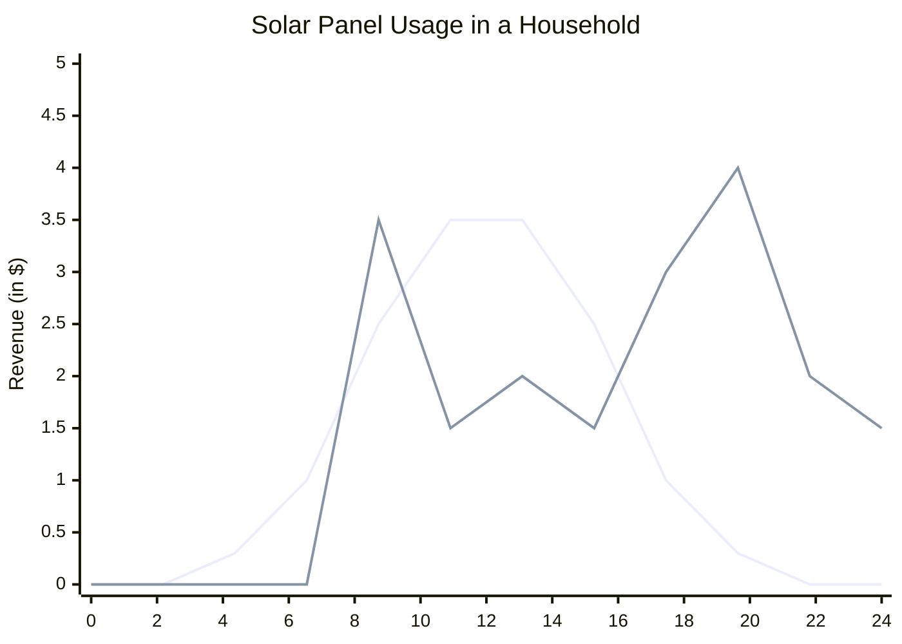

---
aliases:
  - solar panels
---
add a [[Home energy storage|solar battery]] 

solar panel use can smooth out energy peaks in morning and evening

solar panels -- DC --> inverter -- AC --> grid
the solar panels produce [[direct current]] (DC) electricity, while the [[electrical grid]] uses [[alternating current]] (AC) electricity

[[solar energy]]
[[house]]