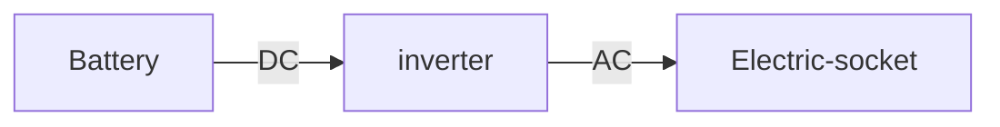

Charge 3 pin devices from your [[electric vehicle]].

cars
- MG ZS EV
- MG4
- BYD Atto 3 
- BYD Dolphin
- BYD Seal
- Hyundai Ioniq 5
- Kia EV6
- Kia EV9
- Kia Niro EV
- Genesis GV60, GV70, G80

other
- Nissan Leaf [[vehicle to home|V2H]], [[vehicle to grid|V2G]] but not V2L
- Cupra Born  [[vehicle to home|V2H]], [[vehicle to grid|V2G]] 

Mitsubishi Outlander, Eclipse Cross - V2G, V2H, V2L

[post](https://www.mgevs.com/threads/v2l-vehicle-to-load-adapter-cable.4954/page-3) about home made V2L adapters, they are so simple that buying one is a rip off.

## DIY
> You can pull about 1500W off your EV car's small battery using a cheap $150 inverter to power a computer, router, cell phone, etc [source](https://diysolarforum.com/threads/system-to-connect-ev-to-home-power-and-use-ev-battery-to-power-home.34473/post-612168)

sample [product](https://www.ukev.shop/product-page/v2l-vehicle-to-load) with list of supported cars